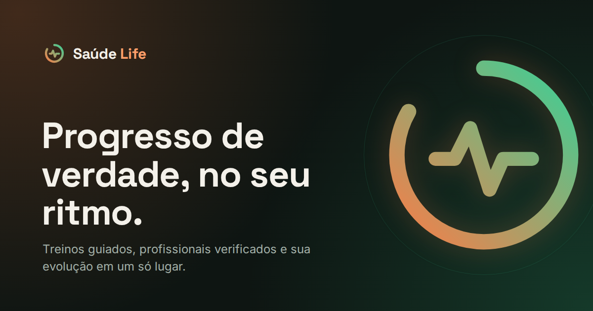

# Saúde Life

Site e app de fitness feito como TCC. Reúne treinos guiados, registro de séries e cargas, acompanhamento da evolução, alimentação, aulas da academia e profissionais verificados.

Feito só com **HTML, CSS e JavaScript puros**, sem frameworks e sem bibliotecas.



## Ver online

**https://chagaspq.github.io/saude-life/**

O site fica publicado pelo GitHub Pages: cada atualização na `main` aparece nesse link em 1 ou 2 minutos.

## Como abrir no computador

1. Abra a pasta do projeto no VS Code.
2. Clique com o botão direito em `index.html` e escolha **Open with Live Server**.
3. O site abre na página de boas-vindas. Crie uma conta e entre: os dados ficam salvos no próprio navegador.

> Abrir o `index.html` direto (duplo clique) também funciona. Só o app instalável e o modo offline precisam do Live Server, porque o navegador exige `http://`.

## O que tem

**Site público**
- Boas-vindas, planos, termos de uso, política de privacidade e página 404.
- Login, cadastro, recuperar e redefinir senha.

**App (depois do login)**
- **Questionário inicial:** objetivo, nível e dias por semana. Personaliza o Início.
- **Início:** resumo da semana, próximo treino sugerido, desafio, recomendados e profissionais.
- **Tela de treino:** séries, repetições e carga editáveis, cronômetro de descanso e resumo no final.
- **Meus treinos:** criar, editar, excluir (com "Desfazer") e iniciar.
- **Evolução:** gráficos de peso, carga e frequência (4, 8 ou 12 semanas), registro de peso e histórico.
- **Alimentação:** macros por cor, refeições do dia e meta de água.
- **Perfil:** objetivos, conquistas, atividade recente, preferências e conta.
- Descobrir, Aulas, Profissionais, Planos, Salvos e Academia.
- No celular: barra de navegação embaixo e app instalável na tela inicial.

## Estrutura

```
index.html            entrada: redireciona para welcome/
404.html              página não encontrada
sw.js                 service worker (instalar e abrir offline)

welcome/  planos/  termos/  politica/   site público
login/  cadastro/  senha/               autenticação

app/                  app logado: uma pasta por página
  inicio/             inicio.html, inicio.css, inicio.js
  descobrir/  treinos/  aulas/  alimentacao/  evolucao/
  profissionais/  planos/  salvos/  academia/  perfil/
  treino/             tela de treino em andamento
  comecar/            questionário de primeiro acesso
  comum/              o que todas as páginas usam
    app.css           layout e componentes (menu, cards, botões, modal)
    app.js            núcleo: sessão, menu, modal, avisos, busca, histórico
    dados.js          dados de exemplo (treinos, exercícios, profissionais...)

shared/
  tokens.css          design system: cores, fontes, espaços, raios, sombras
  base.css            base comum (reset, foco visível, movimento reduzido)
  site.css            cabeçalho e rodapé do site público
  auth.css            partes comuns de login, cadastro e senha
  legal.css/js        termos e política
  planos.css/js       cards de planos (site e app)
  form-utils.js       validação dos formulários
  manifest.webmanifest  configuração do app instalável
  favicon.svg, icon-*.png, og-image.png
```

### Como adicionar uma página nova no app

1. Copie a pasta de uma página parecida (ex.: `app/salvos/`) e renomeie a pasta e os 3 arquivos (ex.: `app/desafios/desafios.html`, `.css` e `.js`).
2. No HTML, troque o `data-pagina` do `<body>` e os nomes do CSS e do JS no `<head>` e no fim da página.
3. Adicione o link no menu de todas as páginas (`../desafios/desafios.html`) e o nome em `PAGINAS` (`app/comum/app.js`) e em `PAGINAS_APP` (`login/login.js`).

## Identidade visual

Todas as cores e medidas vêm de `shared/tokens.css`. Não use cores em hex direto no CSS das páginas.

| Token | Cor | Uso |
|---|---|---|
| `--bg` | `#0e1512` | fundo |
| `--surface` | `#16211d` | cards |
| `--coral` | `#ff7a45` | ação principal (texto em `--on-coral`) |
| `--emerald` | `#34d399` | sucesso, progresso |
| `--ink` / `--muted` | `#f4f1ea` / `#a3b0a8` | texto / texto secundário |

Fontes: **Space Grotesk** (títulos e números) e **Inter** (texto).

## Dados salvos no navegador

Não há servidor: tudo fica no `localStorage`, com o prefixo `sl-`.

| Chave | O que guarda |
|---|---|
| `sl-conta`, `sl-sessao` | conta criada e sessão atual |
| `sl-onboarding` | respostas do questionário inicial |
| `sl-perfil` | nome e bio editados |
| `sl-treinos` | treinos criados |
| `sl-treino-atual` | treino em andamento |
| `sl-historico` | treinos concluídos |
| `sl-pesos` | pesos registrados |
| `sl-refeicoes`, `sl-agua` | alimentação do dia |
| `sl-salvos`, `sl-seguindo`, `sl-reservas`, `sl-desafio` | salvos, profissionais seguidos, aulas e desafio |
| `sl-lidas`, `sl-pref-*` | notificações lidas e preferências |

Para começar do zero: **Perfil → Restaurar dados de exemplo**, ou limpe os dados do site no navegador.

## Limitações (é um protótipo)

- O login é simulado: qualquer e-mail e senha válidos entram, e a senha não é guardada.
- Pagamento dos planos, login com Google/Apple e envio real de e-mail não estão ligados a um serviço.
- Os dados ficam só no navegador onde foram criados.

## Acessibilidade

- Navegação completa por teclado, com foco visível.
- `aria-label` nos botões só com ícone, `aria-current` no menu e `aria-live` nos avisos.
- Contraste AA nas cores principais.
- Animações desligadas quando o sistema pede movimento reduzido.
- Sem rolagem lateral em 360, 768 e 1280 px.
